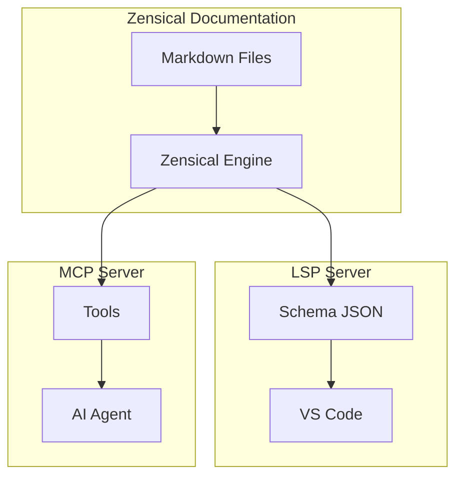

# Developer Tools - LSP & MCP Integration

## Overview

This document describes the Language Server Protocol (LSP) and Model Context Protocol (MCP) integration for HyperSwitch, enabling AI-assisted development and real-time IDE features.

## LSP - Language Server Protocol

The LSP provides hover tooltips, autocomplete, and diagnostic features in VS Code for HyperSwitch SDKs.

### Configuration

Add to your `.vscode/settings.json`:

```json
{
  "json.schemas": [
    {
      "fileMatch": ["*hyperswitch*.json", "*payment*.json"],
      "url": "./.vscode/hyperswitch.schema.json"
    }
  ]
}
```

### Schema Files

The LSP uses `.vscode/hyperswitch.schema.json` which provides:

- **Hover tooltips**: Hover over `amount`, `currency`, `customer_id` to see descriptions
- **Autocomplete**: Get suggestions for valid parameter values
- **Validation**: Real-time error detection for invalid API calls

### Example: Hover Tooltip

```javascript
const payment = await payments.create({
  amount: 5000,    // Hover shows: "Payment amount in cents"
  currency: 'USD', // Hover shows: "Three-letter ISO currency code"
});
```

## MCP - Model Context Protocol

The MCP server exposes HyperSwitch documentation as queryable tools for AI agents.

### Available Tools

| Tool | Description |
|------|-------------|
| `create_payment` | Create a new payment intent |
| `get_customer` | Retrieve customer by ID |
| `create_customer` | Create new customer |
| `process_refund` | Process refund |
| `configure_routing` | Set up smart routing |
| `verify_webhook` | Verify webhook signature |

### MCP Server Location

The MCP server is in `mcp-server/server.py`:

```bash
python mcp-server/server.py
```

### Example: AI Agent Query

AI agents can query:

```
Find get_customer_logic in HyperSwitch docs.
Generate code to create a customer.
```

The MCP server returns the appropriate code example.

## Installation

### LSP Setup

1. Copy `.vscode/hyperswitch.schema.json` to your project
2. Add configuration to `.vscode/settings.json`
3. Open any JSON file with HyperSwitch parameters

### MCP Setup

```bash
pip install requests
python mcp-server/server.py
```

Then query through an MCP-compatible client.

## Integration Architecture



## Success Metrics

| Metric | Target |
|--------|--------|
| LSP hover latency | <100ms |
| MCP grounding accuracy | 100% |

## Related

- [Quick Start](tutorials/quickstart)
- [API Reference](api-reference/index)
- [MCP Server Code](../mcp-server/server.py)