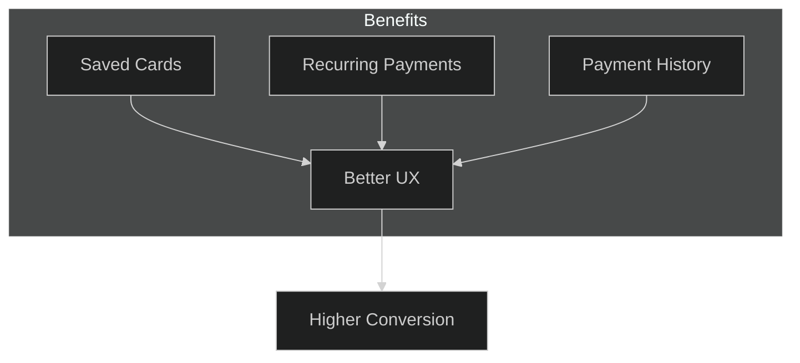
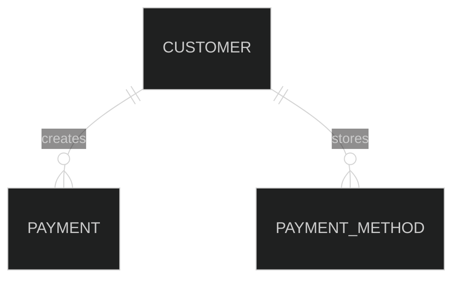

# Manage Customers

## Prerequisites

- [Quick Start](quickstart) - Complete the quick start to understand basic payment flows

## Overview

Learn how to create, update, retrieve, and delete customer records in Hyperswitch. Customer management enables saved payment methods and recurring payments.

## Why Use Customers?



## Create a Customer

=== "cURL"

    ```bash
    curl -X POST https://sandbox.hyperswitch.io/customers \
      -H "Content-Type: application/json" \
      -H "api-key: sk_snd_xxxxxxxxxxxxx" \
      -d '{
        "email": "sarah@example.com",
        "name": "Sarah Johnson",
        "phone": "+1234567890",
        "metadata": {
          "customer_type": "premium"
        }
      }'
    ```

=== "Python"

    ```python
    import requests

    customer_data = {
        "email": "sarah@example.com",
        "name": "Sarah Johnson",
        "phone": "+1234567890",
        "metadata": {"customer_type": "premium"}
    }

    response = requests.post(
        "https://sandbox.hyperswitch.io/customers",
        json=customer_data,
        headers={"api-key": "sk_snd_xxxxxxxxxxxxx"}
    )
    print(response.json())
    ```

=== "JavaScript"

    ```javascript
    const response = await axios.post(
      'https://sandbox.hyperswitch.io/customers',
      {
        email: 'sarah@example.com',
        name: 'Sarah Johnson',
        phone: '+1234567890',
        metadata: { customer_type: 'premium' }
      },
      { headers: { 'api-key': 'sk_snd_xxxxxxxxxxxxx' } }
    );
    ```

=== "Go"

    ```go
    payload := map[string]interface{}{
        "email": "sarah@example.com",
        "name":  "Sarah Johnson",
        "phone": "+1234567890",
        "metadata": map[string]string{"customer_type": "premium"},
    }
    // ... POST to /customers
    ```

=== "Java"

    ```java
    Map<String, Object> customer = Map.of(
        "email", "sarah@example.com",
        "name", "Sarah Johnson",
        "phone", "+1234567890"
    );
    // ... POST to /customers
    ```

=== "C#"

    ```csharp
    var customer = new {
        email = "sarah@example.com",
        name = "Sarah Johnson",
        phone = "+1234567890"
    };
    // ... POST to /customers
    ```

## Response

```json
{
  "customer_id": "cus_abc123",
  "email": "sarah@example.com",
  "name": "Sarah Johnson",
  "phone": "+1234567890",
  "metadata": {
    "customer_type": "premium"
  },
  "created_at": "2026-04-19T12:10:00Z"
}
```

## Retrieve a Customer

=== "cURL"

    ```bash
    curl -X GET https://sandbox.hyperswitch.io/customers/cus_abc123 \
      -H "api-key: sk_snd_xxxxxxxxxxxxx"
    ```

=== "JavaScript"

    ```javascript
    const customer = await axios.get(
      'https://sandbox.hyperswitch.io/customers/cus_abc123',
      { headers: { 'api-key': 'sk_snd_xxxxxxxxxxxxx' } }
    );
    ```

## Update a Customer

=== "cURL"

    ```bash
    curl -X PATCH https://sandbox.hyperswitch.io/customers/cus_abc123 \
      -H "Content-Type: application/json" \
      -H "api-key: sk_snd_xxxxxxxxxxxxx" \
      -d '{
        "name": "Sarah Smith",
        "metadata": {
          "customer_type": "premium",
          "loyalty_points": "5000"
        }
      }'
    ```

=== "JavaScript"

    ```javascript
    const updated = await axios.patch(
      'https://sandbox.hyperswitch.io/customers/cus_abc123',
      {
        name: 'Sarah Smith',
        metadata: { loyalty_points: '5000' }
      },
      { headers: { 'api-key': 'sk_snd_xxxxxxxxxxxxx' } }
    );
    ```

## List Customers

=== "cURL"

    ```bash
    curl -X GET "https://sandbox.hyperswitch.io/customers?limit=10&offset=0" \
      -H "api-key: sk_snd_xxxxxxxxxxxxx"
    ```

=== "JavaScript"

    ```javascript
    const customers = await axios.get(
      'https://sandbox.hyperswitch.io/customers?limit=10',
      { headers: { 'api-key': 'sk_snd_xxxxxxxxxxxxx' } }
    );
    ```

## Response

```json
{
  "customers": [
    {
      "customer_id": "cus_abc123",
      "email": "sarah@example.com",
      "name": "Sarah Johnson",
      "created_at": "2026-04-19T12:10:00Z"
    }
  ],
  "count": 1,
  "limit": 10,
  "offset": 0
}
```

## Delete a Customer

=== "cURL"

    ```bash
    curl -X DELETE https://sandbox.hyperswitch.io/customers/cus_abc123 \
      -H "api-key: sk_snd_xxxxxxxxxxxxx"
    ```

## Customer with Payments



## Use with Payments

Create a payment for an existing customer:

=== "cURL"

    ```bash
    curl -X POST https://sandbox.hyperswitch.io/payments \
      -H "Content-Type: application/json" \
      -H "api-key: sk_snd_xxxxxxxxxxxxx" \
      -d '{
        "amount": 4500,
        "currency": "USD",
        "customer_id": "cus_abc123"
      }'
    ```

## Best Practices

1. **Use customer IDs** - Store `customer_id` in your database
2. **Add metadata** - Track customer segments, tags
3. **Link payments** - Query payments by customer_id

## Related

- [API Reference: Customers](/docs/api-reference/index.html#customers)
- [How-To: Manage Payment Methods](howto/accept-payment.html)