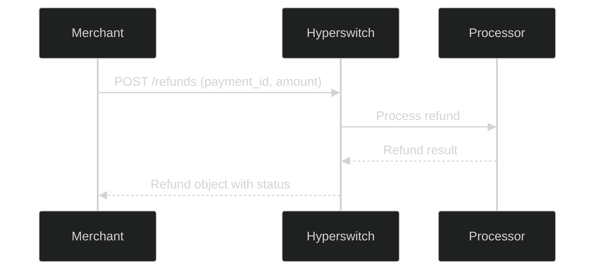
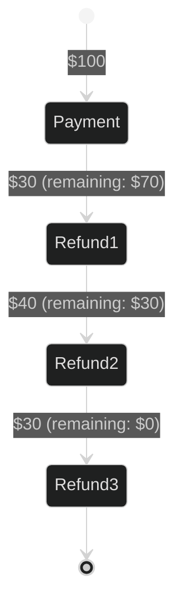

# Process Refunds

## Prerequisites

- [Quick Start](quickstart) - Complete the quick start to understand basic payment flows
- [Customers](customers) - Learn how to create customers for better tracking

## Overview

Learn how to process refunds in Hyperswitch. Hyperswitch supports full and partial refunds, and you can track refund status in real-time.

## What You'll Learn

- Process full refunds
- Process partial refunds
- Check refund status
- Handle refund errors

## Refund Flow



## Full Refund

To refund the entire payment amount, simply omit the `amount` parameter:

=== "cURL"

    ```bash
    curl -X POST https://sandbox.hyperswitch.io/refunds \
      -H "Content-Type: application/json" \
      -H "api-key: sk_snd_xxxxxxxxxxxxx" \
      -d '{
        "payment_id": "pay_abc123xyz",
        "reason": "requested_by_customer"
      }'
    ```

=== "Python"

    ```python
    import requests

    response = requests.post(
        "https://sandbox.hyperswitch.io/refunds",
        json={
            "payment_id": "pay_abc123xyz",
            "reason": "requested_by_customer"
        },
        headers={"api-key": "sk_snd_xxxxxxxxxxxxx"}
    )
    print(response.json())
    ```

=== "JavaScript"

    ```javascript
    const response = await axios.post(
      'https://sandbox.hyperswitch.io/refunds',
      {
        payment_id: 'pay_abc123xyz',
        reason: 'requested_by_customer'
      },
      { headers: { 'api-key': 'sk_snd_xxxxxxxxxxxxx' } }
    );
    ```

=== "Go"

    ```go
    payload := map[string]interface{}{
        "payment_id": "pay_abc123xyz",
        "reason":     "requested_by_customer",
    }
    // ... HTTP POST to /refunds
    ```

=== "Java"

    ```java
    Map<String, Object> refund = Map.of(
        "payment_id", "pay_abc123xyz",
        "reason", "requested_by_customer"
    );
    // ... OkHttp POST to /refunds
    ```

=== "C#"

    ```csharp
    var refund = new {
        payment_id = "pay_abc123xyz",
        reason = "requested_by_customer"
    };
    // ... HttpClient POST to /refunds
    ```

## Response

```json
{
  "refund_id": "ref_xyz789",
  "payment_id": "pay_abc123xyz",
  "amount": 6540,
  "status": "succeeded",
  "reason": "requested_by_customer",
  "created_at": "2026-04-19T12:05:00Z"
}
```

## Partial Refund

To refund only a portion of the payment, specify the `amount`:

=== "cURL"

    ```bash
    curl -X POST https://sandbox.hyperswitch.io/refunds \
      -H "Content-Type: application/json" \
      -H "api-key: sk_snd_xxxxxxxxxxxxx" \
      -d '{
        "payment_id": "pay_abc123xyz",
        "amount": 3270,
        "reason": "requested_by_customer"
      }'
    ```

=== "JavaScript"

    ```javascript
    const response = await axios.post(
      'https://sandbox.hyperswitch.io/refunds',
      {
        payment_id: 'pay_abc123xyz',
        amount: 3270,  // Half the original amount
        reason: 'requested_by_customer'
      },
      { headers: { 'api-key': 'sk_snd_xxxxxxxxxxxxx' } }
    );
    ```

## Multiple Partial Refunds

You can issue multiple partial refunds until the total reaches the original payment amount:



## Check Refund Status

Retrieve a specific refund:

=== "cURL"

    ```bash
    curl -X GET https://sandbox.hyperswitch.io/refunds/ref_xyz789 \
      -H "api-key: sk_snd_xxxxxxxxxxxxx"
    ```

=== "JavaScript"

    ```javascript
    const refund = await axios.get(
      'https://sandbox.hyperswitch.io/refunds/ref_xyz789',
      { headers: { 'api-key': 'sk_snd_xxxxxxxxxxxxx' } }
    );
    ```

## Refund Status Values

| Status | Description |
|--------|-------------|
| `succeeded` | Refund completed successfully |
| `pending` | Refund is being processed |
| `failed` | Refund failed - check error message |
| `cancelled` | Refund was cancelled before completion |

## Refund Reasons

Use these standard reasons:

| Reason | Use Case |
|--------|----------|
| `requested_by_customer` | Customer requested refund |
| `duplicate` | Duplicate charge detected |
| `fraudulent` | Suspicious/ fraudulent transaction |

## Error Handling

=== "cURL"

    ```bash
    # Example error - refund already fully refunded
    {
      "error_code": "refund_already_processed",
      "error_message": "The payment has already been fully refunded",
      "amount_refunded": 6540,
      "attempted_amount": 3270
    }
    ```

## Playground

<a href="https://sandbox.hyperswitch.io/playground?endpoint=/refunds&method=POST" class="md-button-playground" target="_blank">Try in Playground →</a>

## Best Practices

1. **Always verify** refund status before responding to customers
2. **Store refund_id** in your database for reconciliation
3. **Handle webhooks** to track async refund status changes
4. **Check processor limits** - some processors have refund windows

## Next Steps

- [Smart Routing](routing) - Configure intelligent payment routing
- [Webhooks](webhooks) - Set up real-time notifications

## Related

- [API Reference: Refunds](../api-reference/refunds/index)
- [How-To: Accept Payment](../howto/accept-payment)