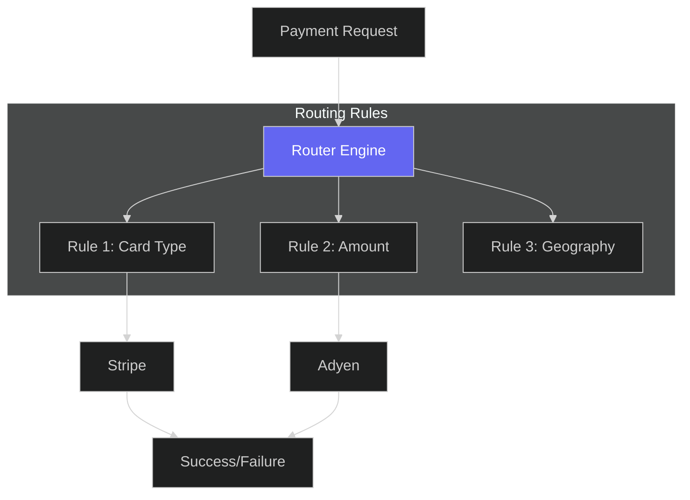
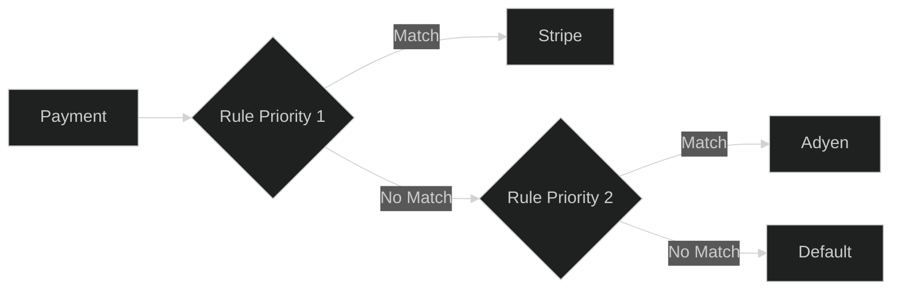

# Configure Smart Routing

## Prerequisites

- [Quick Start](quickstart) - Complete the quick start to understand basic payment flows
- [Connectors](connectors) - Set up payment processors before configuring routing

## Overview

Learn how to set up intelligent payment routing to optimize for success rate, cost, or speed. Hyperswitch's routing engine lets you define rules that automatically route payments to the best processor.

## Routing Architecture



## Create a Routing Profile

=== "cURL"

    ```bash
    curl -X POST https://sandbox.hyperswitch.io/routing \
      -H "Content-Type: application/json" \
      -H "api-key: sk_snd_xxxxxxxxxxxxx" \
      -d '{
        "name": "Default Routing",
        "rules": [
          {
            "name": "Priority routing",
            "condition": {
              "field": "card.bin",
              "type": "starts_with",
              "value": "4"
            },
            "action": {
              "type": "route_to",
              "connector": "stripe"
            },
            "priority": 1
          },
          {
            "name": "Fallback",
            "condition": {
              "type": "always"
            },
            "action": {
              "type": "route_to",
              "connector": "adyen"
            }
          }
        ]
      }'
    ```

=== "JavaScript"

    ```javascript
    const routing = await axios.post(
      'https://sandbox.hyperswitch.io/routing',
      {
        name: 'Default Routing',
        rules: [
          {
            name: 'Priority routing',
            condition: { field: 'card.bin', type: 'starts_with', value: '4' },
            action: { type: 'route_to', connector: 'stripe' },
            priority: 1
          },
          {
            name: 'Fallback',
            condition: { type: 'always' },
            action: { type: 'route_to', connector: 'adyen' }
          }
        ]
      },
      { headers: { 'api-key': 'sk_snd_xxxxxxxxxxxxx' } }
    );
    ```

## Routing Conditions

| Condition Type | Description | Example |
|----------------|-------------|---------|
| `card.bin` | Card BIN prefix | "4" for Visa |
| `amount` | Payment amount | > 1000 |
| `currency` | Currency code | "USD" |
| `country` | Billing country | "US" |
| `custom_field` | Metadata field | order_type: "subscription" |

## Rule Priority



## Advanced Routing Examples

### Route by Amount

=== "cURL"

    ```bash
    curl -X POST https://sandbox.hyperswitch.io/routing \
      -H "api-key: sk_snd_xxxxxxxxxxxxx" \
      -d '{
        "rules": [
          {
            "name": "High value - route to Stripe",
            "condition": { "field": "amount", "operator": "gte", "value": 10000 },
            "action": { "type": "route_to", "connector": "stripe" },
            "priority": 1
          },
          {
            "name": "Low value - route to Adyen",
            "condition": { "field": "amount", "operator": "lt", "value": 10000 },
            "action": { "type": "route_to", "connector": "adyen" },
            "priority": 2
          }
        ]
      }'
    ```

### Route by Card Type

=== "JavaScript"

    ```javascript
    const rules = [
      {
        name: 'Visa cards to Stripe',
        condition: { field: 'card.brand', equals: 'visa' },
        action: { type: 'route_to', connector: 'stripe' },
        priority: 1
      },
      {
        name: 'Mastercard to Adyen',
        condition: { field: 'card.brand', equals: 'mastercard' },
        action: { type: 'route_to', connector: 'adyen' },
        priority: 2
      }
    ];
    ```

## Fallback Configuration

When the primary connector fails, automatically retry with a backup:

=== "cURL"

    ```bash
    curl -X POST https://sandbox.hyperswitch.io/routing \
      -H "api-key: sk_snd_xxxxxxxxxxxxx" \
      -d '{
        "name": "With Fallback",
        "rules": [
          {
            "name": "Primary",
            "condition": { "type": "always" },
            "action": { "type": "route_to", "connector": "stripe" }
          }
        ],
        "fallback": {
          "connectors": ["adyen", "paypal"],
          "retry_count": 3
        }
      }'
    ```

## Monitor Routing Performance

=== "cURL"

    ```bash
    curl -X GET "https://sandbox.hyperswitch.io/routing/analytics?start_date=2026-04-01&end_date=2026-04-19" \
      -H "api-key: sk_snd_xxxxxxxxxxxxx"
    ```

## Response

```json
{
  "connector_stats": [
    {
      "connector": "stripe",
      "success_rate": 98.5,
      "avg_latency_ms": 450,
      "volume": 125000,
      "revenue": 850000
    },
    {
      "connector": "adyen",
      "success_rate": 97.2,
      "avg_latency_ms": 380,
      "volume": 45000,
      "revenue": 320000
    }
  ]
}
```

## Best Practices

1. **Start simple** - Begin with a single rule, then iterate
2. **Monitor closely** - Watch success rates per connector
3. **Set up fallbacks** - Always have backup connectors
4. **Test thoroughly** - Use webhooks to track routing decisions

## Related

- [API Reference: Routing](api-reference/index.html#routing)
- [How-To: Configure Connectors](howto/accept-payment.html)